<p align="center"></p>
<p align="center">ÉCOLE DE TECHNOLOGIE SUPÉRIEURE</p>
<p align="center">UNIVERSITÉ DU QUÉBEC</p>
<br /><br /><br /><br /><br /><br />

<p align="center">TRAVAIL PRÉSENTÉ À FABIO PETRILLO, MAKHLOUF HENNINE DANS LE CADRE DU COURS LOG430-02</p>
<br /><br /><br /><br /><br /><br />

<p align="center">BROKERX – PHASE 3 : ARCHITECTURE ORIENTÉE ÉVÉNEMENTS</p>
<br /><br /><br /><br /><br />

<p align="center">PAR</p>
<p align="center">VAILLANCOURT, Simon-Olivier</p>
<p align="center">VAIS80330101</p>
<br /><br /><br /><br /><br /><br />

<p align="center">MONTRÉAL, LE 06/12/2025</p>

<div style="page-break-after: always;"></div>

# Table des matières

  
  - [Arc42 et DDD](#arc42-et-ddd)
    - [1. Introduction et Objectifs](#1.-introduction-et-objectifs)
      - [Panorama des exigences](#panorama-des-exigences)
        - [Priorisation des cas d'utilisation](#priorisation-des-cas-d'utilisation)
      - [Objectifs qualité](#objectifs-qualité)
      - [Parties prenantes](#parties-prenantes)
    - [2. Contraintes d'architecture](#2.-contraintes-d'architecture)
    - [3. Portée et contexte du système](#3.-portée-et-contexte-du-système)
      - [Contexte métier](#contexte-métier)
      - [Contexte technique](#contexte-technique)
    - [4. Stratégie de solution](#4.-stratégie-de-solution)
    - [5. Vue des blocs de construction](#5.-vue-des-blocs-de-construction)
    - [6. Vue d'exécution](#6.-vue-d'exécution)
    - [7. Vue de déploiement](#7.-vue-de-déploiement)
    - [8. Concepts transversaux](#8.-concepts-transversaux)
    - [9. Décisions d'architecture](#9.-décisions-d'architecture)
    - [10. Exigences qualité](#10.-exigences-qualité)
      - [Efficacité de performance](#efficacité-de-performance)
      - [Fiabilité](#fiabilité)
      - [Maintenabilité](#maintenabilité)
    - [11. Risques et dettes techniques](#11.-risques-et-dettes-techniques)
    - [12. Glossaire](#12.-glossaire)
    - [Vues 4+1](#vues-4+1)
      - [Vue logique](#vue-logique)
      - [Vue de développement](#vue-de-développement)
      - [Vue des processus](#vue-des-processus)
      - [Vue physique](#vue-physique)
      - [Scénarios](#scénarios)
  - [Runbook](#runbook)
  - [Guide d'utilisation](#guide-d'utilisation)
    - [Créer un compte](#créer-un-compte)
    - [Se connecter](#se-connecter)
    - [Se déconnecter](#se-déconnecter)
    - [Approvisionner son portfeuille](#approvisionner-son-portfeuille)
    - [Passer un ordre](#passer-un-ordre)
    - [Annuler un ordre](#annuler-un-ordre)
    - [Modifier un ordre](#modifier-un-ordre)
    - [Appariement et exécution](#appariement-et-exécution)
    - [Abonnement aux données du marché](#abonnement-aux-données-du-marché)
  - [Évolution des performances](#Évolution-des-performances)
      - [Phase 1 - Architecture Monolithique](#phase-1---architecture-monolithique)
        - [Tests de charge](#tests-de-charge)
      - [Phase 2 - Architecture Microservices](#phase-2---architecture-microservices)
        - [Tests de charge](#tests-de-charge)
      - [Phase 3 - Architecture Événementielle](#phase-3---architecture-Événementielle)
        - [Tests de charge](#tests-de-charge)
  - [Autres remarques](#autres-remarques)
    - [CI/CD](#ci/cd)
    - [Documentation des APIs](#documentation-des-apis)
    - [Structure des logs](#structure-des-logs)
  - [Annexes](#annexes)
    - [Liste des ADRs](#liste-des-adrs)
    - [Cas d'utilisation](#cas-d'utilisation)

<div style="page-break-after: always;"></div>

# Arc42 et DDD

Ce document, basé sur le modèle arc42, décrit une plateforme de courtage en ligne pour investisseurs particuliers dans le cadre du cours LOG430.

## 1. Introduction et Objectifs

### Panorama des exigences
BrokerX est une plateforme de courtage en ligne permettant à des investisseurs d'émettre des ordres, consulter leur portefeuilles, recevoir exécutions et confirmations puis effectuer le règlement et la compensation des transactions.

L'objectif principal de BrokerX est de fournir une platforme de courtage fiable, performante et sécurisée pouvant supporter un grand nombre de transactions simultannées.

#### Priorisation des cas d'utilisation
| Priorité | UC | Justification |
|----------|----|---------------|
| **Must** | UC-03: Approvisionnement du portefeuille | Nécessaire pour placer un ordre d'achat. |
| **Must** | UC-05: Placement d’un ordre (marché/limite) avec contrôles pré-trade | Permet d'exécuter le matching des ordres (UC-07) qui est aussi un cas d'utilisation prioritaire. Sans cette fonctionnalité, il n'y aurait aucun autre moyen d'acheter ou de vendre.  |
| **Must** | UC-07: Appariement interne & Exécution | Core de la plateforme, algorithme principal. |
| **Should** | UC-04: Abonnement aux données du marché | Devrait être implémenté si possible car a un impacte sur le placement d'un ordre. Toutefois, cet impacte est mineur donc ce cas n'est pas prioritaire. |
| **Should** | UC-06: Modification / Annulation d’un ordre | Comme UC-04, ce cas impacte aussi le placement d'un ordre mais il n'est pas absolument nécessaire. |
| **Could** | UC-01: Inscription & Vérification d’identité | Nécessaire pour les prochaines itérations, mais on peut fonctionner avec un compte existant pour l'instant. |
| **Could** | UC-02: Authentification & MFA | Nécessaire pour les prochaines itérations, mais on peut fonctionner avec un compte pré-connecté pour l'instant. |
| **Won't** | UC-08: Confirmation d’exécution & Notifications | Bonus pour le UX mais pas prioriatire pour l'instant. |

### Objectifs qualité
| Priorité | Objectif qualité | Scénario |
|----------|------------------|----------|
| 1 | **Efficacité de performance** | Être capable de gérer un débit d'au moins 1200 ordres par seconde avec un temps de latence de moins de 100 ms. |
| 2 | **Fiabilité** | Avoir une disponibilité d'au moins 99.9%. |
| 4 | **Maintenabilité** | Code simple et bien structuré pour faciliter l'évolution. |

### Parties prenantes
- Développeur: Analyse de la logique métier, conception de l'architecture, implémentation, documentation, tests et déploiement.
- Clients: Utilisent la plateforme via son interface.
- Instrument Service: Stock tous les instruments et l'historique des quotes
- Portfolio Service: Effectue toute la gestion des portfolios des utilisateurs (solde, positions, historique des transactions)
- Matching Engine: Effectue l'appariement des ordres, la validation des trades et stock les ordres du carnet

## 2. Contraintes d'architecture
| Contrainte | Description |
|------------|-------------|
| **Technologie** | Utilisation de Docker |
| **Déploiement** | Déploiement via conteneur Docker et pipeline CI/CD sur une machine virtuelle |
| **Style d'architecture** | Architecture microservices |
| **Solution de persistance** | Implémenter une couche de persistance cohérente (ORM ou DAO) |

## 3. Portée et contexte du système
### Contexte métier
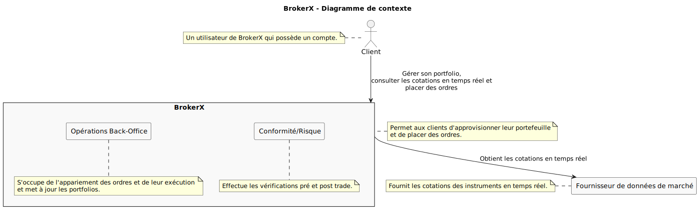 \
<i>Le diagramme ci-haut démontre le contexte du système. Les clients de BrokerX communiquent avec la plateforme afin de gérer leur portfolio, consulter les cotations du marché et placer des ordres. Ensuite, BrokerX s'occupe de l'appariement et de l'exécution des ordres au fur et à mesure que des nouvels ordres sont placés par les clients. Finalement, BrokerX communique en parallèle avec un fournisseur de données de marché pour afficher les cotations aux clients.</i>

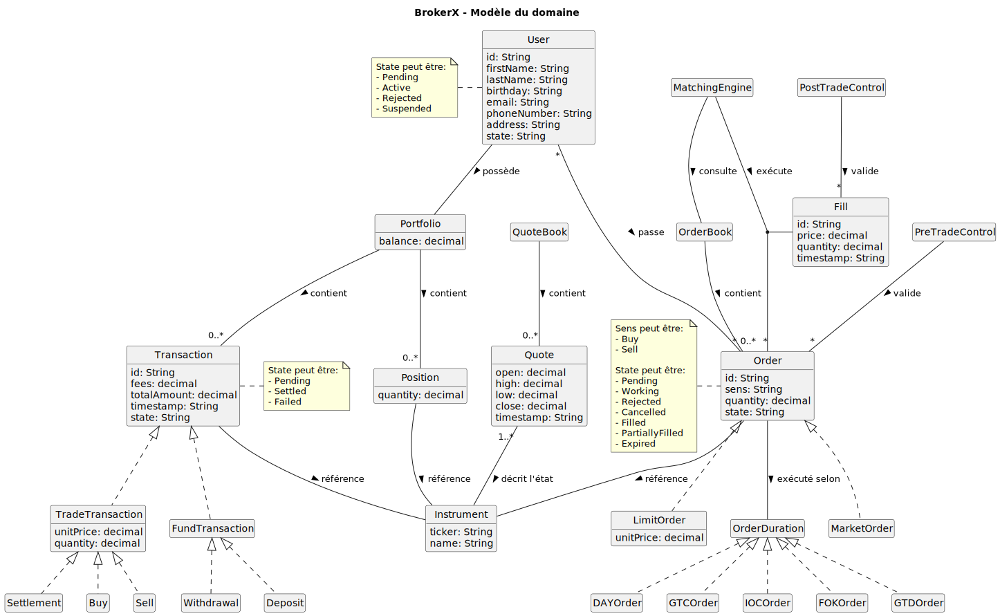 \
<i>Le diagramme ci-haut présente le modèle du domaine de BrokerX. Premièrement, il décrit les clients (User) et leur portfolio (solde, positions, transactions, etc). Deuxièmement, il décrit les ordres et ce qui les entours (carnet d'ordres, matching engine, contrôle pré-trade, etc).</i>

### Contexte technique
Client: Application Blazor Server (C#) \
Persistence: Base de données PostgreSQL

## 4. Stratégie de solution
| Problème | Stratégie de solution | Justification | 
|----------|-----------------------|---------------|
| **Efficacité de performance** | Utiliser C# et PostgreSQL | Combiner la puissance de C# et les query optimisées de Postgres permettra d'atteindre les critères de performance demandé. |
| **Fiabilité** | Utilisation d'une base de données SQL | Propriétés ACID. |
| **Maintenabilité** | Utiliser une architecture hexagonale avec C# | En découplant le business core du reste du système, il sera facile de changer de framework au besoin. |

<div style="page-break-after: always;"></div>

## 5. Vue des blocs de construction
 \
<i>Le diagramme ci-haut démontre la vue logique du système. Il s'agit d'un diagramme de classe qui reprend les concepts du domaine du domaine et les illustre sous forme de classe.</i>

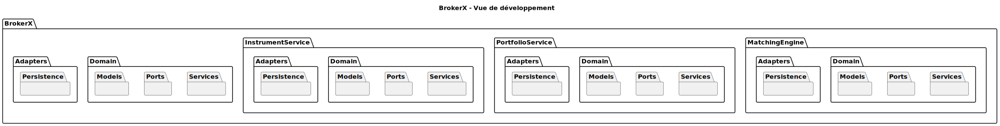 \
<i>Le diagramme ci-haut démontre la vue de développement du système. Il s'agit d'une représentation de l'implémentation et de l'organisation des artéfacts de code. On y retrouve la mise en forme d'une architecture hexagonale.</i>

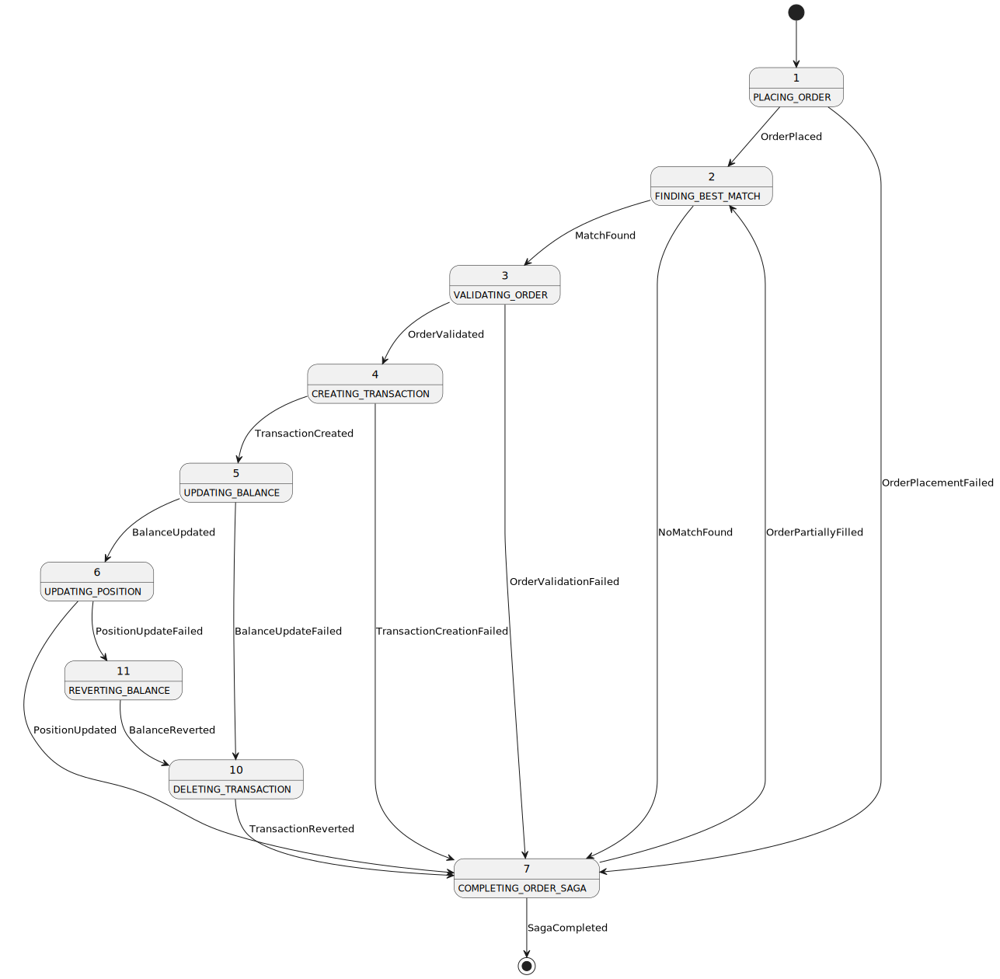 \
<i>Le diagramme ci-haut démontre le diagrame d'état de la saga chorégraphiée du moteur d'appariement.</i>

<div style="page-break-after: always;"></div>

## 6. Vue d'exécution
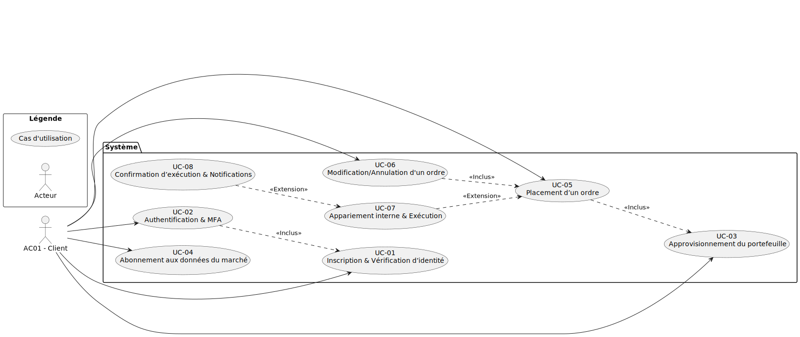 \
<i>Le diagramme ci-haut démontre les cas d'utilisation de la première phase. Pour plus de détails, voir la section pour la priorisation des cas d'utilisation.</i>

## 7. Vue de déploiement
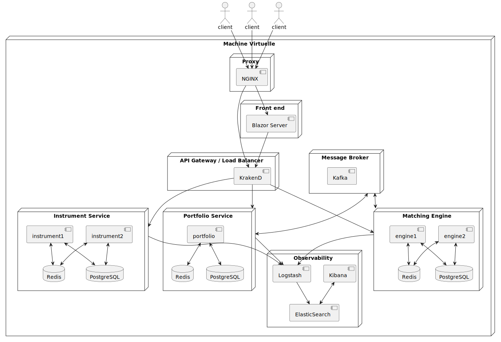 \
<i>Le diagramme ci-haut visualize l'architecture de déploiement du système. Celui-ci sera déployé sur une machine virtuelle qui host un Docker container. Ce conteneur contient l'application et sa base de données.</i>

<div style="page-break-after: always;"></div>

## 8. Concepts transversaux
- Ordres et exécutions
- Portefeuille, portfolio et positions
- Cotations
- Conformité et risque
- Observabilité et audit
- Microservices
- Message broker
- Architecture hexagonale
- Persistence, base de données SQL, ACID

## 9. Décisions d'architecture
Voir la liste des ADRs en annexe.

## 10. Exigences qualité

### Efficacité de performance
Être capable de gérer un débit d'au moins 1200 ordres par seconde avec un temps de latence de moins de 100 ms.

### Fiabilité
Avoir une disponibilité d'au moins 99.9%.

### Maintenabilité
Code simple et bien structuré pour faciliter l'évolution.

## 11. Risques et dettes techniques
- Très difficile de faire de la scalabilité horizontale avec une base de donnée SQL
- Complexité ajoutée si on doit modifier le schéma de la base de données
- Point de défaillance unique: si la base de donnée plante, le système devient complètement inutilisable

## 12. Glossaire
| Terme | Définition |
|-------|------------|
| **Ordre** | Directive d'achat ou de vente d'un titre, comme une action, un FNB ou une option, à un prix donné ou selon certaines conditions |
| **CI/CD** | Continuous Integration/Continuous Deployment : pratiques d'automatisation du développement et déploiement des applications |
| **ORM** | Object-Relational Mapping: couche d'abstraction qui traduit les objets en tables relationnelles et vice-versa |
| **DAO** | Data Access Object: abstrait les opérations de base de données |
| Priorité **Must** | Aspect non-négociable qui est absolument nécessaire |
| Priorité **Should** | Aspect important mais non vital, qui apporte une valeur significative |
| Priorité **Could** | Aspect agréable à avoir mais qui a un impact faible si il est exclu |
| **Carnet d'ordres** | Liste des ordres actifs en attente de matching par le moteur d'exécution |
| **Exécution** (Fill) | Événement qui résulte de l’appariement d’un ordre avec une contrepartie dans le carnet d’ordres |
| **Instrument** | Actif financier négociable |
| **Cotation** (Quote) | Information de marché en temps réel décrivant l’état d’un instrument |
| **Portfolio** | Ensemble des avoirs financiers d’un utilisateur (liquidité & positions) et son historique des transactions |
| **Position** | Quantité d’un instrument financier détenue par un utilisateur dans son portfolio |
| **Règlement** | Mise à jour des positions et soldes après exécution |
| **Ordre au marché**(Market order) | Exécuté immédiatement au meilleur prix disponible |
| **Ordre à cours limité** (Limit order) | Exécuté seulement au prix limite ou meilleur |
| **Day order** (DAY) | Ordre valide jusqu’à la fin de la journée de trading |
| **Good Till Cancelled** (GTC) | Ordre qui reste active jusqu’à annulation par le client (ou expiration système) |
| **Immediate-Or-Cancel** (IOC) | Exécution immédiate d'un ordre, partiel possible, reste annulé |
| **Fill-Or-Kill** (FOK) | Ordre qui doit être exécuté entièrement tout de suite, sinon annulé |
| **Good-Till-Date** (GTD) | Ordre qui est actif jusqu’à une date/heure précise. |

<div style="page-break-after: always;"></div>


## Vues 4+1

### Vue logique
 \
<i>Le diagramme ci-haut démontre la vue logique du système. Il s'agit d'un diagramme de classe qui reprend les concepts du domaine du domaine et les illustre sous forme de classe.</i>

### Vue de développement
 \
<i>Le diagramme ci-haut démontre la vue de développement du système. Il s'agit d'une représentation de l'implémentation et de l'organisation des artéfacts de code. On y retrouve la mise en forme d'une architecture hexagonale.</i>

<div style="page-break-after: always;"></div>

### Vue des processus
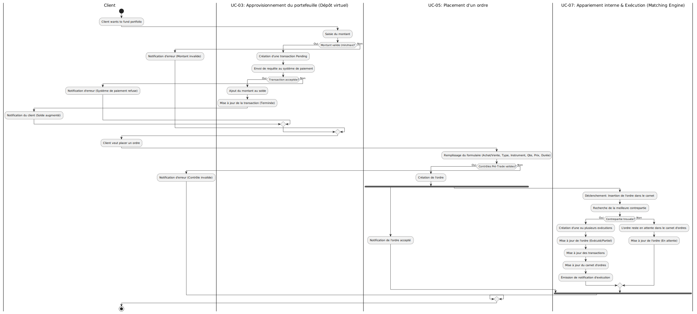 \
<i>Le diagramme ci-haut démontre la vue des processus du système. Soit la communication entre les éléments de l'architecture pendant la réalisation des cas d'utilisation.</i>

### Vue physique
 \
<i>Le diagramme ci-haut visualize l'architecture de déploiement du système. Celui-ci sera déployé sur une machine virtuelle qui host un Docker container. Ce conteneur contient l'application et sa base de données.</i>

<div style="page-break-after: always;"></div>

### Scénarios
 \
<i>Le diagramme ci-haut démontre les cas d'utilisation de la première phase. Pour plus de détails, voir la section pour la priorisation des cas d'utilisation.</i>

<div style="page-break-after: always;"></div>


# Runbook
Voici les étapes à suivre afin de démarrer le système:
1. Télécharger et décompresser le dossier « BrokerX »
2. Lançer le logiciel Docker
3. Dans un terminal, se rendre à la racine du dossier « BrokerX »
4. Copier-Coller les commandes dans le terminal:
```bash
cd src
cd MessageBroker && docker compose up --build -d && cd ..
cd BrokerX && docker compose up --build -d && cd ..
cd Gateway && docker compose up --build -d && cd ..
cd BrokerX.InstrumentService && docker compose up --build -d && cd ..
cd BrokerX.MatchingEngine && docker compose up --build -d && cd ..
cd BrokerX.PortfolioService && docker compose up --build -d && cd ..
cd Observability && docker compose up --build -d && cd ..
```
5. Attendre que tous les conteneurs soient up et opérationnels
6. Se rendre à l'adresse http://localhost:5000 pour accéder au système

Au moment d'accéder à l'application, les conteneurs Docker devraient avoir ces états:
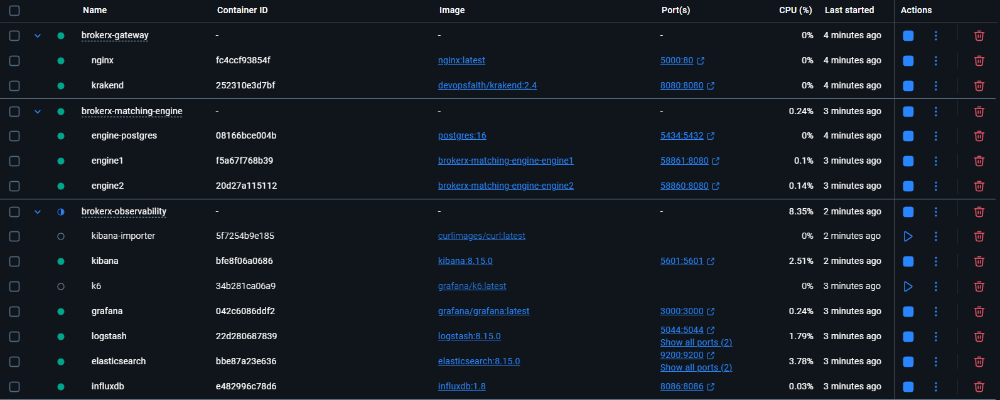
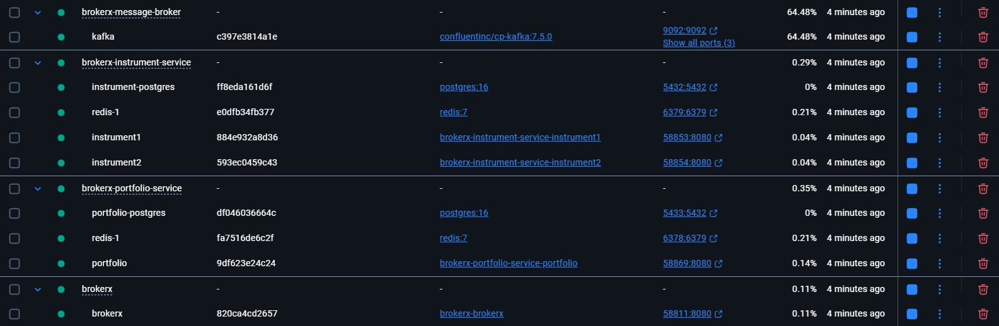

<div style="page-break-after: always;"></div>


# Guide d'utilisation
## Créer un compte
1. Se rendre à l'adresse ```/sign-up``` ou depuis la page de connexion, cliquer sur "Aucun compte? Inscrivez-vous ici".
2. Remplir le formulaire - Ex:
    - Adresse courriel: test@test.com
    - Mot de passe: test
    - Prénom: Test
    - Nom: Test
    - Date de naissance: 2000-01-01 (une date valide est entrée par défaut, il n'est pas nécessaire de la modifier)
    - Adresse: Test
    - Numéro de téléphone: (000)-000-0000

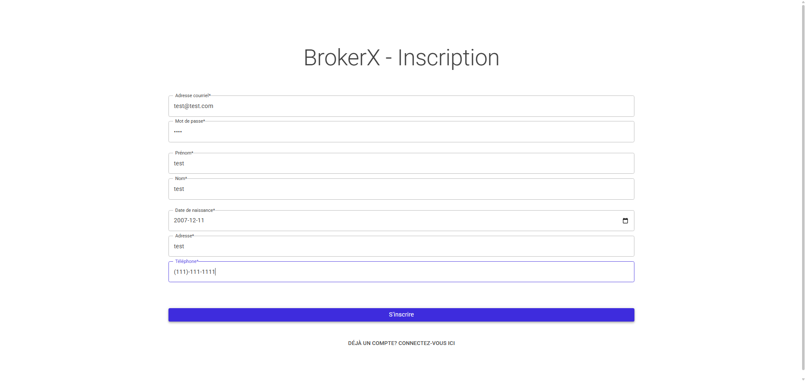

3. Cliquer sur "S'inscrire". Vous serez rediriger vers la page de vérification MFA.
4. Pour vérifier le MFA, entrer le code "9999", puis cliquer sur "Vérifier".
5. Vous êtes maintenant connecté à votre nouveau compte.
6. À savoir que votre nouveau compte démarre avec une balance de $1000.

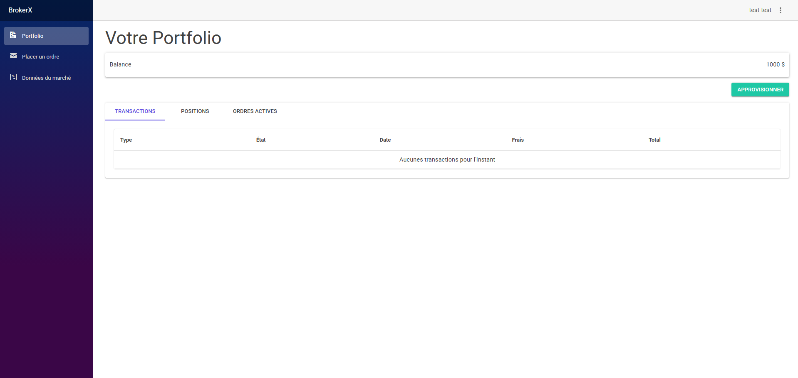

## Se connecter
1. Depuis la page de connexion, remplir le courriel et le mot de passe de votre compte.
2. Cliquer sur "Se Connecter". Vous serez rediriger vers la page de vérification MFA.
4. Pour vérifier le MFA, entrer le code "9999", puis cliquer sur "Vérifier".
5. Vous êtes maintenant connecté à votre compte.

## Se déconnecter
1. Lorsque vous êtes connecté, cliquer sur le menu supérieur-gauche.
2. Cliquer sur "Se Déconnecter". Vous serez rediriger vers la page de connexion.
3. Vous êtes maintenant déconnecté.

## Approvisionner son portfeuille
1. Depuis la page ```/portfolio```, cliquer sur "Approvisionner".
2. Saisir un montant puis cliquer sur "Approvisionner".
    - À des fins de simulation, tous montant supérieur à $500 sera automatiquement refusé.
    - Tous montant entre $1 et $500 inclusivement sera accepté.
3. Une nouvelle transaction "en attente" apparait dans vos transactions récentes ainsi qu'une notification qui indique que le traitement de votre dépôt est en cours.
4. Après un délai de 5s, le statut de la nouvelle transaction sera mis à jour, de même pour la balance du compte. Une notification apparaitra pour indiquer la fin du dépôt.

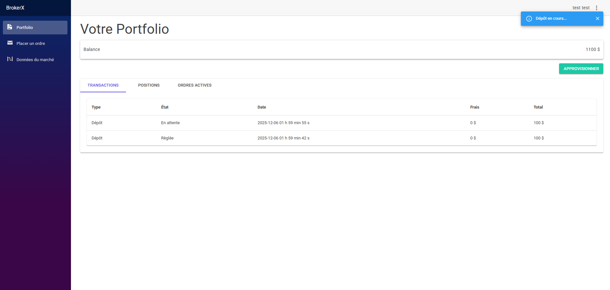

## Passer un ordre
1. Se rendre à l'adresse ```/orders``` ou cliquer sur "Placer un ordre" dans le menu de gauche.
2. Remplir le formulaire normallement. Tous les types d’ordres et de durées sont supporté et fonctionnel.
3. L’option « Auto-Match », permet de simuler un match automatiquement. Cette option est activée par défaut. Si cette option est désactivée, le nouvel ordre ne sera pas exécuté automatiquement.
4. Cliquer sur "Placer l'ordre".
5. Si une erreur se produit lorsqu’on envoit l’ordre, c’est que la pré-validation a échoué. Dans le cas d’un achat, cela est fort probablement dû au fait que le portefeuille n’a pas assez de fond. Dans le cas d’une vente, c’est le fait que le portfolio ne contient pas les positions nécessaires pour effectuer la vente.

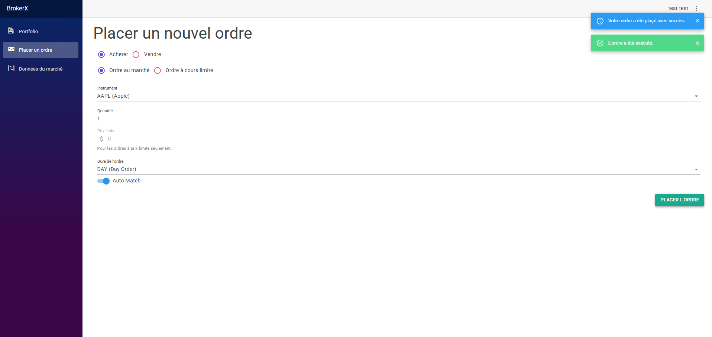

## Annuler un ordre
1. Si un ordre a été créé sans l’option « Auto-Match », il est possible de l’annuler puisqu’il ne sera pas exécuté automatiquement. La durée de l'ordre ne doit pas être IOC ou FOK.
2. Pour voir la liste des ordres actives, il faut se rendre dans le portfolio sous l’onglet des ordres actives.
3. Choisir un ordre puis cliquer sur « retirer ».

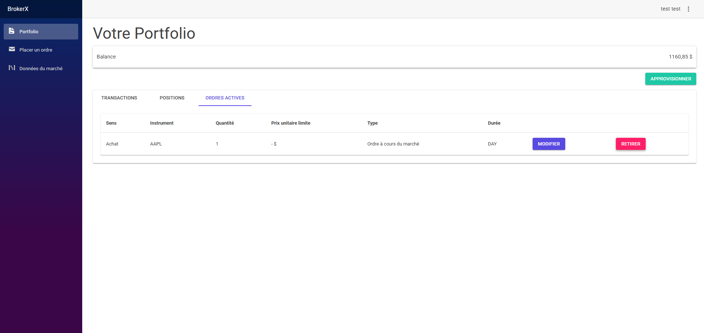

## Modifier un ordre
1. Les ordres pouvant être annulés peuvent aussi être modifé
2. Il faut suivre la même procédure que pour l’annulation, mais cliquer sur le bouton « modifier »
3. Le formulaire d’ordre va apparaitre et pourra être rempli à nouveau
4. Lorsque la modification sera envoyée, l’option « Auto-Match » sera activée automatiquement et l’ordre sera exécuté.

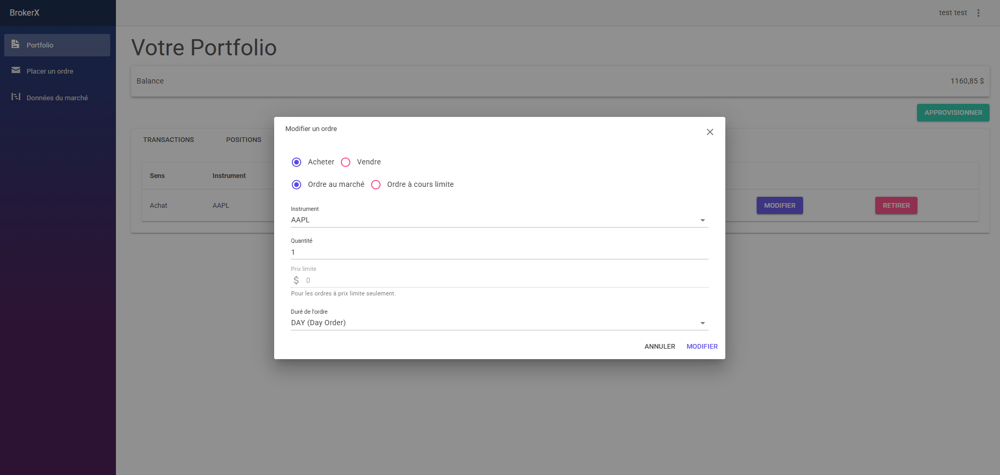

## Appariement et exécution
1. Si l’option « Auto-Match » a été activée pour la création d’un ordre, celui-ci trouvera un match et sera exécuté entièrement et immédiattement.
2. Si l’option est désactivée, l’ordre restera « Working » jusqu'à ce qu'il expire.
3. Pour chaque exécution entière ou partiel, on peut voir une transaction dans la page portfolio sous l'onglet "Transactions".
4. Il y a une validation pré et post trade avant l’exécution de chaque ordre. Ces validations s’assurent que les deux parties ont les fonds et les positions nécessaire pour procéder à l’exécution.
5. L’expiration des ordres est vérifiée automatiquement par le système pendant l’exécution des trades. Il y a aussi un service journalier qui s’occupe de vérifier l’expiration des ordres DAY et GTC afin de ne jamais avoir d’ordre expiré qui traine dans le carnet.

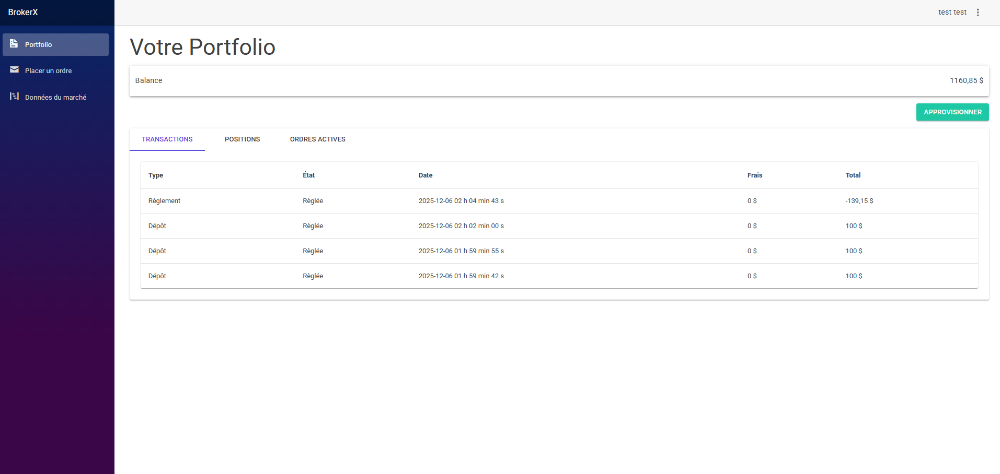

## Abonnement aux données du marché
1. Se rendre à l'adresse ```/quotes``` ou cliquer sur "Données du marché" dans le menu de gauche.
2. Sélectionner un instrument.
3. Optionnellement, on peut choisir la date de début et la date de fin de la période à observer.
4. Finalement, il faut cliquer sur « Chercher » pour obtenir les cotations.

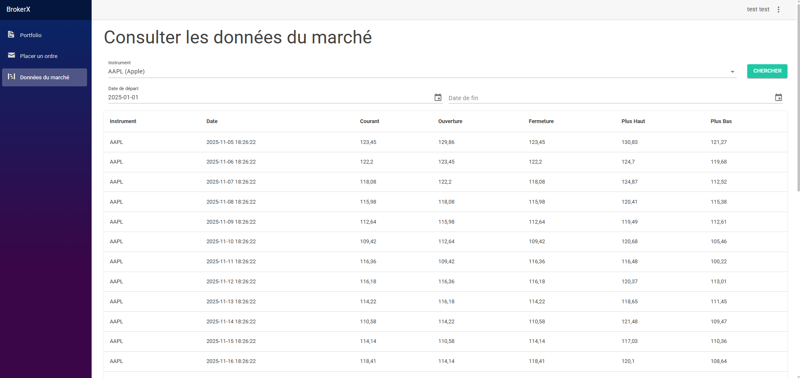

<div style="page-break-after: always;"></div>


# Évolution des performances

Les tests de charge ont été effectué avec K6 et visualisé avec Grafana.


### Phase 1 - Architecture Monolithique
#### Tests de charge
Les tests de charge de la phase 1 montrent que la plateforme respecte en grande partie les exigences définies dans le cahier des charges. Celui-ci demandait notamment un débit minimal de 300 requêtes par seconde, un temps de réponse P95 inférieur à 500 ms et une disponibilité de 90%.

Les résultats obtenus dépassent largement ces seuils. Le Pic RPS a atteint 5046, soit environ 68 % au-dessus du seuil minimal requis. Le temps de réponse moyen s’est établi à 252,9 ms, soit environ 50 % plus rapide que la limite attendue. Aucun échec HTTP n’a été enregistré, et le taux d’erreur est demeuré nul tout au long du test, ce qui démontre une bonne stabilité du service sous charge. Le temps de réponse maximal observé (1,24 s) demeure acceptable dans un contexte de pic extrême.

En résumé, l’architecture actuelle satisfait et dépasse les performances exigées pour la phase 1, tout en offrant une marge de sécurité significative pour les phases ultérieures.

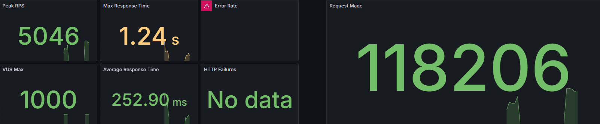
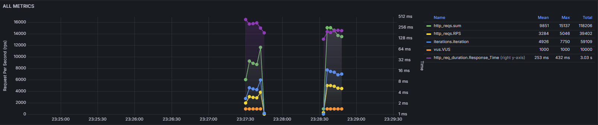
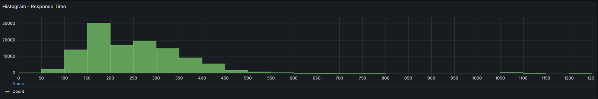
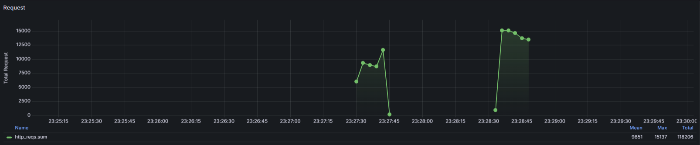
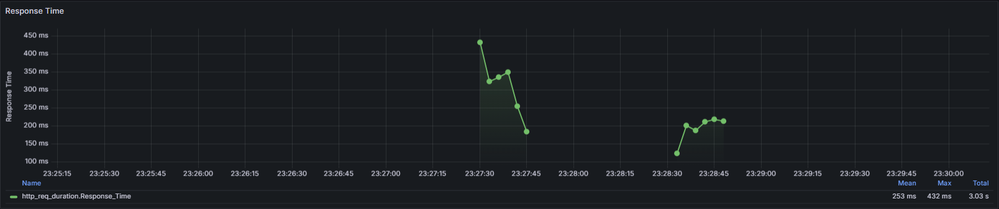
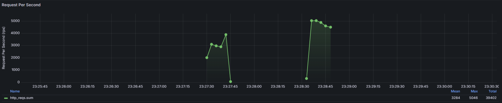
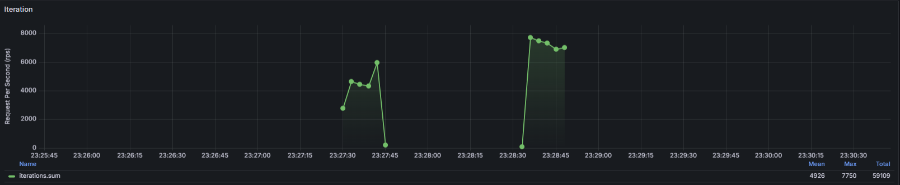
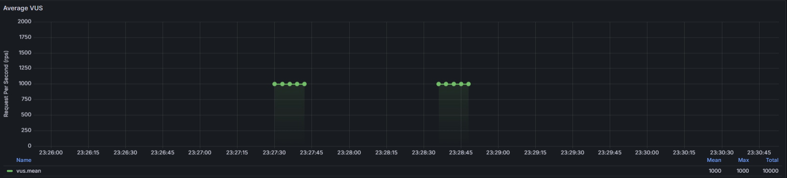
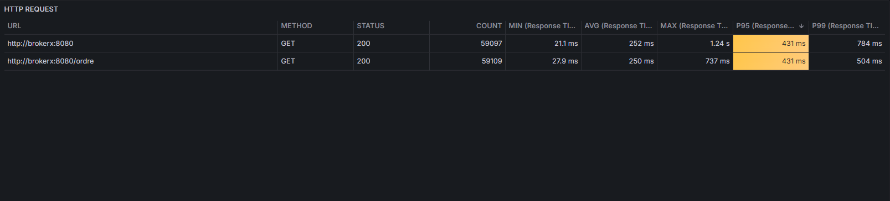
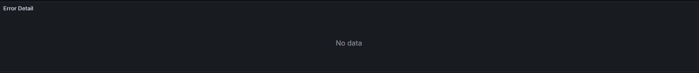

<div style="page-break-after: always;"></div>


### Phase 2 - Architecture Microservices
#### Tests de charge
Les tests de charge de la phase 2 confirment que la plateforme continue de répondre efficacement aux exigences du cahier des charges. Pour cette phase, les objectifs étaient : maintenir un débit d’au moins 800 requêtes par seconde, conserver un temps de réponse P95 sous les 150 ms et une disponibilité de 95,5%.

Les résultats obtenus dépassent nettement ces seuils. Le Peak RPS a atteint 666, soit un peu en-dessous du seuil minimal demandé. Le temps de réponse moyen observé est particulièrement performant à 43,59 ms, soit environ 70 % plus rapide que la limite fixée. Le temps de réponse maximal s’élève à 470 ms, ce qui reste acceptable dans des conditions de pointe.

On note toutefois 5 erreurs HTTP, qui représentent une proportion très faible (~0,03 % des requêtes envoyées). Ce volume est négligeable dans le contexte d’un test intensif, mais il sera pertinent de vérifier qu’elles ne proviennent pas d’un problème structurel.

En conclusion, la plateforme satisfait entièrement les exigences de la phase 2 et montre une performance significativement supérieure aux attentes, avec une excellente réactivité et une marge confortable pour absorber une charge encore plus élevée.

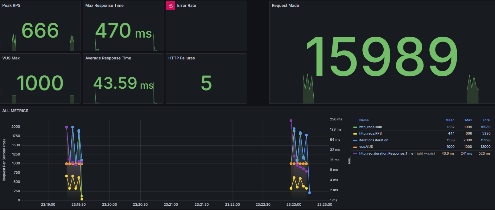
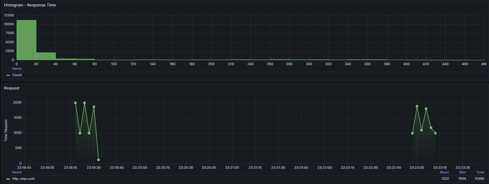
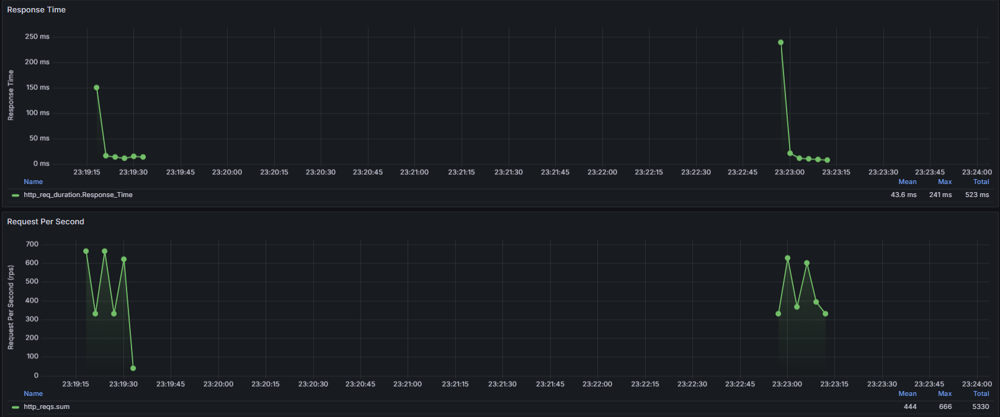
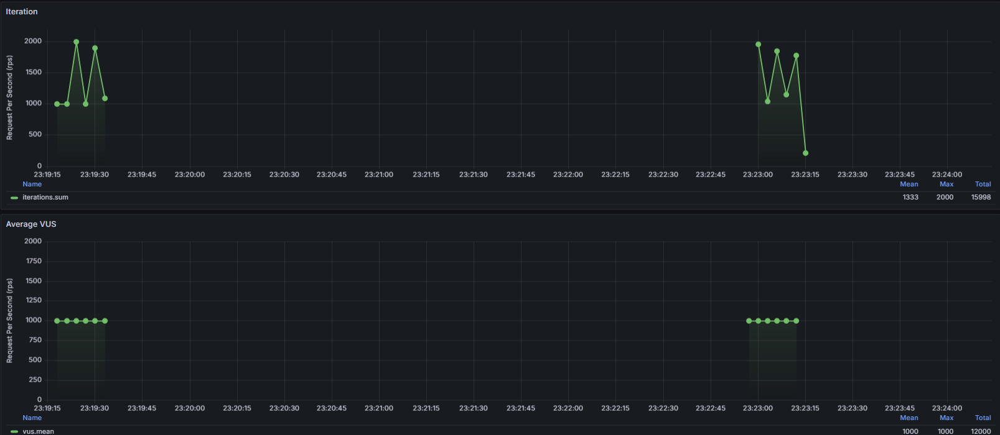
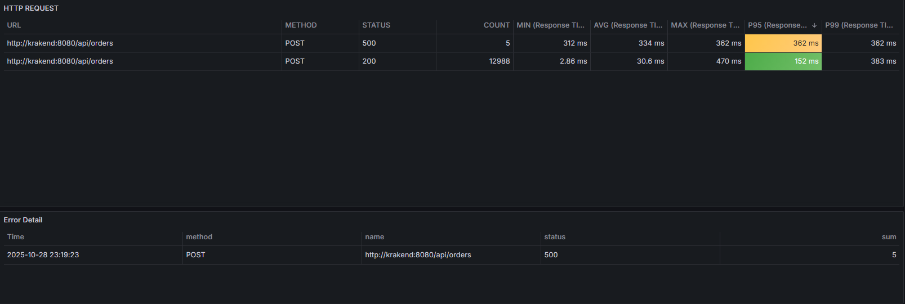

<div style="page-break-after: always;"></div>


### Phase 3 - Architecture Événementielle
#### Tests de charge
Les tests de charge de la phase 3 démontre que la plateforme n'arrive pas tout à fait à répondre aux exigences du cahier des charges. Pour cette phase, les objectifs étaient : maintenir un débit d’au moins 1200 requêtes par seconde, conserver un temps de réponse P95 sous les 100 ms et une disponibilité de 99,9%.

Les résultats obtenus dépassent nettement ces seuils. Le Peak RPS a atteint 700, soit pas mal en-dessous du seuil minimal demandé. Le temps de réponse moyen observé est particulièrement performant à 136,12 ms, soit environ 40 ms plus lent que la limite fixée. Le temps de réponse maximal s’élève à 2,27 s, ce qui est long dans des conditions de pointe.

On note aussi 304 erreurs HTTP. Ce volume est beaucoup plus élevé qu'à la phase précédente.

En conclusion, la plateforme ne satisfait pas les exigences de la phase 3. Par contre, il faut noter que les tests effectués n'ont pas été effectués sur une architecture de production, mais bien sur une seule machine. De ce fait, les stratégies mises en place comme le horizontal scaling ne sont pas utile dans ce cas. Il est donc normal de voir des performances en dessous des attentes.

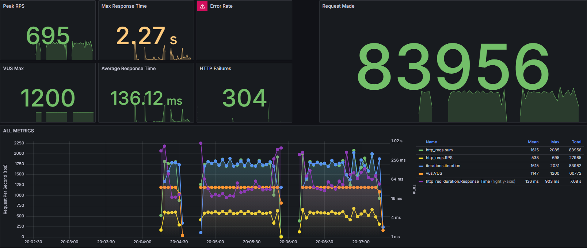
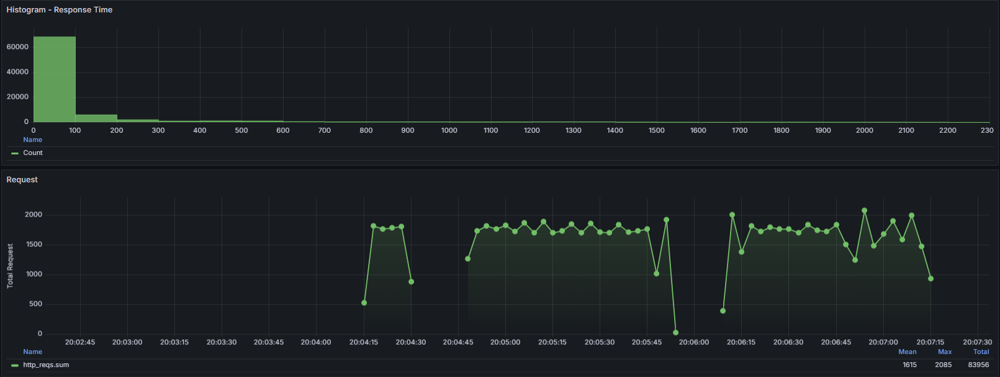
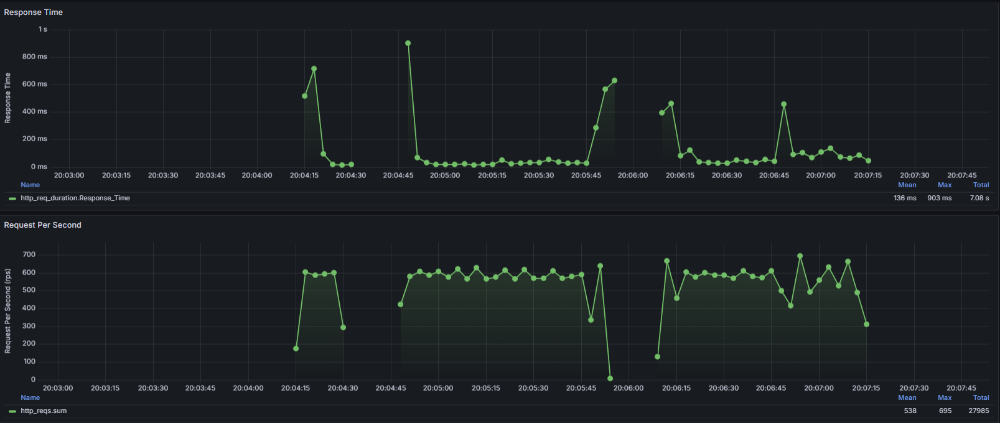
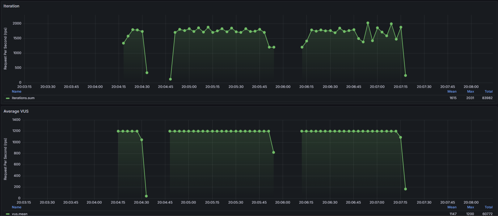
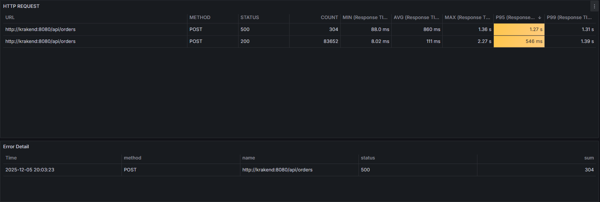

<div style="page-break-after: always;"></div>


# Autres remarques

## CI/CD
Plusieurs workflows sont utilisé afin d'optimiser et d'automatiser certaines tâches:
- ```deploy.yaml```: Déploie le système sur la machine virtuelle fournit pas l'ÉTS.
- ```tests.yaml```: Exécute les tests.
- ```plantuml.yaml```: Génère les fichiers .svg à partir des diagrames Plantuml. Ces images sont ensuite référencé dans les différentes parties du rapport.
- ```report.yaml```: Automatise la création de ce rapport en compilant tous les fichiers de documentation dans le dossier ```/docs``` et en générant/formattant tout autre contenu nécessaire.

<div style="page-break-after: always;"></div>


## Documentation des APIs
Le dossier ```docs/collection``` contient une collection Postman. Celle-ci présente tous les endpoints de tous les APIs des différents microservices (Matching engine, Portfolio et instruments)

Portfolio API:
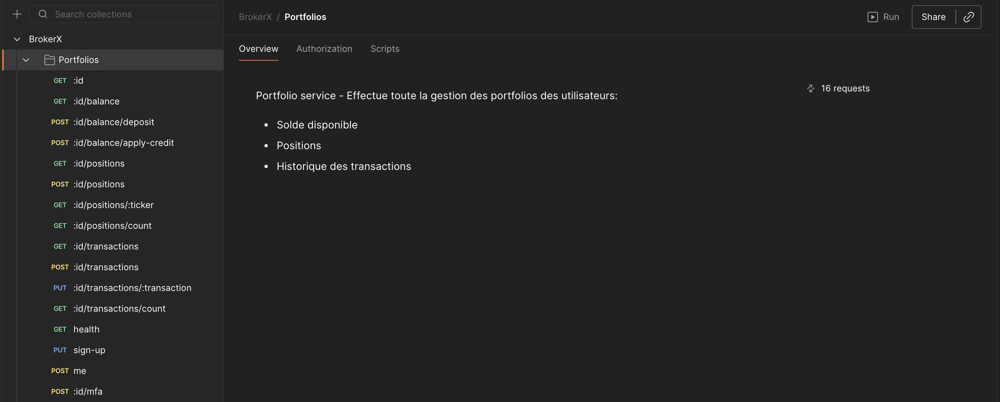

Instrument API:
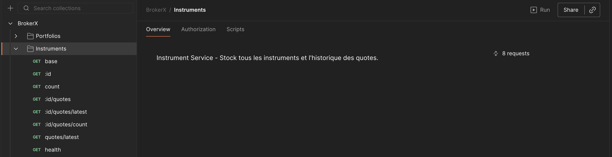

Matching Engine API:


<div style="page-break-after: always;"></div>


## Structure des logs
BrokerX utilise le ```ELK``` stack pour gérer ses logs. Un pipeline Logstash a été configuré afin d'identifier la provenance de chaque log, ce qui permet d'associer un microservice à chaque log. De plus, un dashboard Kibana a été configuré pour observer plusieurs éléments intéressants:
- Une liste des derniers logs
- Le nombre total de logs
- Les endpoints les plus visités
- La distribution de l'utilisation des microservices
- Les types de logs les plus fréquents (info, warning, error, etc)
- La distribution des opérations de lecture vs. écriture

Lorsque le conteneur ```brokerx-observability``` est en marche, le dashboard est disponible à l'adresse http://localhost:5601/app/dashboards#/view/4e774102-803c-46ba-8fc9-ac47032e3333?_g=(filters:!())

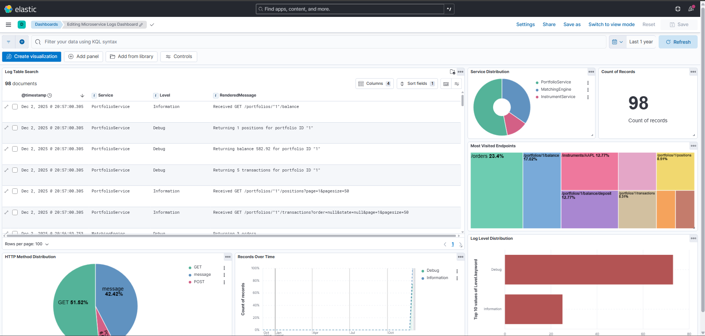

<div style="page-break-after: always;"></div>


# Annexes

## Liste des ADRs

<table style="page-break-inside: avoid; break-inside: avoid;">
<tr><th>ADR</th><td>001</td></tr>
<tr><th>Nom</th><td>Utilisation d'une architecture hexagonale (ports and adapters)</td></tr>
<tr><th>Statut</th><td><p>Acceptée</p></td></tr>
<tr><th>Contexte</th><td><p>Le système BrokerX doit être flexible et maintenable facilement. La plateforme contient une logique métier riche et évolutive qui doit être indépendante des autres composants et technologies utilisés. De plus, nous savons que l'architecture du système évoluera en une architecture évenementielle et microservices.</p></td></tr>
<tr><th>Décision</th><td><p>Nous adopterons une architecture hexagonale (ports and adapter) en tandem avec le repository pattern.</p></td></tr>
<tr><th>Conséquences</th><td><p>L'adoption de ce style d'architecture est plus long à mettre en place car elle est plus complexe que MVC par exemple. Cependant, ce style d'architecture apporte plusieurs avantages:</p>
<ul>
  <li>Séparation des responsabilités: Faible couplage et forte cohésion.</li>
  <li>Testabilité: Facile de tester chaque module indépendement.</li>
  <li>Évolutivité: Facile de changer les adapteurs au besoin pour faire évoluer la plateforme. Facilitera aussi le changement vers les autres styles d'architecture.</li>
</ul></td></tr>
</table>
<br /><br />
<table style="page-break-inside: avoid; break-inside: avoid;">
<tr><th>ADR</th><td>002</td></tr>
<tr><th>Nom</th><td>Utilisation d'une base de données SQL (PostgreSQL)</td></tr>
<tr><th>Statut</th><td><p>Acceptée</p></td></tr>
<tr><th>Contexte</th><td><p>Le domaine métier de BrokerX a plusieurs exigences au niveau des données. Celles-ci doivent rester cohérente et leur lecture doit être fiable et performante.</p></td></tr>
<tr><th>Décision</th><td><p>Nous allons utiliser une base de données SQL, plus précisement, PostgreSQL.</p></td></tr>
<tr><th>Conséquences</th><td><p>L'utilisation d'une base de données SQL nous permet de bonifier de ses propriétés ACID. Disons que dans le future, on scale horizontalement le moteur d'appariement. L'isolation des transactions fait en sorte qu'il n'y aura pas de conflit lors de l'exécution d'ordres.</p>
<p>PostgreSQL permet aussi de faire des requêtes complexes et puissantes. En revanche, il sera plus compliqué d'effectuer des migrations si nécessaire, et la scalability horizontale est plus difficile avec une base de données SQL.</p></td></tr>
</table>
<br /><br />
<table style="page-break-inside: avoid; break-inside: avoid;">
<tr><th>ADR</th><td>003</td></tr>
<tr><th>Nom</th><td>Utilisation de C# et Blazor Server comme framework</td></tr>
<tr><th>Statut</th><td><p>Dépréciée</p></td></tr>
<tr><th>Contexte</th><td><p>BrokerX nécessite une technologie qui permet de:</p>
<ul>
  <li>développer rapidement une interface utilisateur</li>
  <li>réduit la complexité opérationnelle (monolithe)</li>
  <li>utiliser un language de programmation performant (C#)</li>
</ul></td></tr>
<tr><th>Décision</th><td><p>Nous utiliserons le framework Blazor Server pour l'implémentation monolithique de BrokerX. Cela implique aussi que nous utiliserons C# comme language de programmation.</p></td></tr>
<tr><th>Conséquences</th><td><p>L'utilisation de Blazor permet de mettre en place un prototype rapidement pour la phase monolithique du projet. L'utilisation de C# offre une flexibilité qui permet de changer de framework, si nécessaire, dans les phases futures du projet.</p></td></tr>
</table>
<br /><br />
<table style="page-break-inside: avoid; break-inside: avoid;">
<tr><th>ADR</th><td>004</td></tr>
<tr><th>Nom</th><td>Utilisation d'Entity Framework Core comme ORM</td></tr>
<tr><th>Statut</th><td><p>Acceptée</p></td></tr>
<tr><th>Contexte</th><td><p>Le système doit posséder une couche de persistance robuste et fiable qui garantit l'intégrité des données.</p></td></tr>
<tr><th>Décision</th><td><p>Nous allons utiliser un ORM, soit Entity Framework Core.</p></td></tr>
<tr><th>Conséquences</th><td><p>L'utilisation d'EF apporte plusieurs avantage:</p>
<ul>
  <li>Supporte plusieurs moteurs de base de données</li>
  <li>Permet l'utilisation de plusieurs base de données (persistance polyglote)</li>
  <li>Permet d'initialiser les base de données facilement et de les 'seeder', ce qui facilite les déploiements et le développement</li>
  <li>Permet d'effectuer des migrations facilement</li>
  <li>Développement accéléré de la couche de persistance</li>
</ul>
<p>Par contre, Entity Framework donne moins de flexibilité pour effectuer des requêtes SQL pures.</p></td></tr>
</table>
<br /><br />
<table style="page-break-inside: avoid; break-inside: avoid;">
<tr><th>ADR</th><td>005</td></tr>
<tr><th>Nom</th><td>Utilisation de Blazor Server comme frontend du système</td></tr>
<tr><th>Statut</th><td><p>Acceptée</p></td></tr>
<tr><th>Contexte</th><td><p>Avec l'évolution de l'architecture monolithique vers une architecture en microservices, il faut découpler l'interface utilisateur du reste du système.</p></td></tr>
<tr><th>Décision</th><td><p>Comme la première version du système utilise Blazor Server, il en sera de même pour la deuxième phase du projet.</p></td></tr>
<tr><th>Conséquences</th><td><p>En gardant Blazor Server, on supprime le besoins de re-développer l'interface utilisateur. De plus, grâce à l'architecture hexagonale adopté dans l'ADR 001, le changement vers une architecture en microservices n'affectera pas le frontend, puisqu'il suffit de changer les adapteurs utilisés.</p></td></tr>
</table>
<br /><br />
<table style="page-break-inside: avoid; break-inside: avoid;">
<tr><th>ADR</th><td>006</td></tr>
<tr><th>Nom</th><td>Répartition des microservices</td></tr>
<tr><th>Statut</th><td><p>acceptée</p></td></tr>
<tr><th>Contexte</th><td><p>Le système doit migrer d'une architecture monolithique vers une architecture en microservices. Il faut alors décider comment séparer le monolithe actuel en plusieurs microservices.</p></td></tr>
<tr><th>Décision</th><td><p>Les microservices seront divisés de la manière suivante:</p>
<ul>
  <li>Matching Engine: Effectue l'appariement des ordres, la validation des trades et stock les ordres du carnet.</li>
  <li>Portfolio service: Effectue toute la gestion des portfolios des utilisateurs (solde, positions, historique des transactions).</li>
  <li>Instrument service: Stock tous les instruments et l'historique des quotes.</li>
</ul></td></tr>
<tr><th>Conséquences</th><td><p>Il y a plusieurs avantages à séparer les microservices de cette manière. Premièrement, cette sépration offre une forte cohésion et un faible couplage, puisque chaque service est responsable de son propre domaine métier.</p>
<p>Par contre, cette sépration nécessite que certain microservices communiquent entre eux. Notemment, l'instrument service qui devra fournir des données pour pratiquement chaque autre service.</p></td></tr>
</table>
<br /><br />
<table style="page-break-inside: avoid; break-inside: avoid;">
<tr><th>ADR</th><td>007</td></tr>
<tr><th>Nom</th><td>Utilisation de Redis comme solution de caching</td></tr>
<tr><th>Statut</th><td><p>Acceptée</p></td></tr>
<tr><th>Contexte</th><td><p>Afin d'optimiser la performance du système, celui-ci doit mettre en place un cache pour les endpoints critiques, ce qui permet de réduire le temps des requêtes et épargner des ressources physiques sur l'architecture.</p></td></tr>
<tr><th>Décision</th><td><p>Chaque microservice utilisera une base de données Redis comme solution de cache.</p></td></tr>
<tr><th>Conséquences</th><td><p>Comparé à une solution de cache en mémoire, Redis permetterait d'effectuer du horizontal-scaling proprement. C'est-à-dire que si on veut doubler les instances d'un service, chaque instance aura accès à un cache partagé. Cela évite la duplication de données à travers les instances. De plus, Redis offre une grande rapidité et est simple et rapide à mettre en place.</p></td></tr>
</table>
<br /><br />
<table style="page-break-inside: avoid; break-inside: avoid;">
<tr><th>ADR</th><td>008</td></tr>
<tr><th>Nom</th><td>Utilisation d'une stratégie de cache hybride</td></tr>
<tr><th>Statut</th><td><p>Acceptée</p></td></tr>
<tr><th>Contexte</th><td><p>Afin d'optimiser la performance du système, celui-ci doit mettre en place un cache pour les endpoints critiques, ce qui permet de réduire le temps des requêtes et épargner des ressources physiques sur l'architecture.</p></td></tr>
<tr><th>Décision</th><td><p>Le moteur d'appariement utilisera la stratégie "Write-Behind" et le reste du système utilisera la stratégie "Cache-Aside".</p></td></tr>
<tr><th>Conséquences</th><td><p>La stratégie "Write-Behind" écrit les données dans le cache directement et dans la base de données plus tard. Cette stratégie offre une vitesse de lecture rapide, une complexité d'écriture moyenne et est idéale pour les systèmes qui doivent effectuer beaucoup d'opérations d'écriture. Étant donné que le moteur d'appariement doit effectuer des mises à jour rapidement sur les ordres, il est essentiel que ces opérations soit fait rapidement. De plus, le fait de lire le cache directement améliore les performances de lecture. Cette stratégie entraine un risque de perte de données puisque la base de données n'est pas mise à jour instantanement. Par contre, ce risque peut être contré avec des solutions comme Redis with AOF (append only file).</p>
<p>La stratégie "Cache-Aside" met à jour le cache seulement lorsqu'il y a des caches miss. Cela permet de garder en cache seulement les données qui sont demandés par le reste du système ce qui permet de ne pas remplir le cache pour rien. Le désavantage de cette stratégie est que la première requête pour obtenir une donnée sera plus lente que les suivantes, puisqu'il y aura forcément un cache miss. Finalement, cette stratégie est adapté pour le service d'instruments et des portfolios car elle est simple à implémenter et offre des gains de performances immédiats.</p></td></tr>
</table>
<br /><br />
<table style="page-break-inside: avoid; break-inside: avoid;">
<tr><th>ADR</th><td>009</td></tr>
<tr><th>Nom</th><td>Utilisation du horizontal-scaling</td></tr>
<tr><th>Statut</th><td><p>Acceptée</p></td></tr>
<tr><th>Contexte</th><td><p>Étant donné qu'on demande une faible latence (≤ 250 ms) et un débit élevé (800 ordres/s ≥), il faut que le système puisse scale afin de répondre à ces demandes.</p></td></tr>
<tr><th>Décision</th><td><p>Le système effectuera du horizontal-scaling afin d'offrir des performances plus élevées.</p></td></tr>
<tr><th>Conséquences</th><td><p>Cette solution est plus facile à implémenter que du vertical-scaling puisqu'il suffit simplement d'ajouter des instances de nos services. De plus, en utilisatn NGINX, il est facile de distribuer la charge entre chaque instances.</p></td></tr>
</table>
<br /><br />
<table style="page-break-inside: avoid; break-inside: avoid;">
<tr><th>ADR</th><td>010</td></tr>
<tr><th>Nom</th><td>Utilisation de la stratégie de load balancing "Least Connections"</td></tr>
<tr><th>Statut</th><td><p>Acceptée</p></td></tr>
<tr><th>Contexte</th><td><p>Étant donné que nous avons choisit d'utiliser du horizontal-scaling auprès des microservices, il faut choisir un algorithme pour distribuer la charge entre les instances déployées.</p></td></tr>
<tr><th>Décision</th><td><p>Nous allons utiliser la stratégie "Least Connections" et "IP Hash" pour distribuer la charge entre les instances déployées.</p></td></tr>
<tr><th>Conséquences</th><td><p>La stratégie "Least Connections" permet d'envoyer les requêtes à l'instance qui a le moins de connexion active. Cela permet d'éviter de surcharger une instance et de causer des erreurs et une latence plus élevé. Cette stratégie sera utilisé pour le matching engine et le service des instruments car ces services doivent répondre le plus rapidement possible.</p>
<p>La stratégie "IP Hash" permet de toujours rediriger un même utilisateur vers la même instance. Cela est utile pour les services qui ont besoin d'établir des sessions à long terme, ce qui est le cas pour Blazor.</p></td></tr>
</table>
<br /><br />
<table style="page-break-inside: avoid; break-inside: avoid;">
<tr><th>ADR</th><td>011</td></tr>
<tr><th>Nom</th><td>Observabilité des logs</td></tr>
<tr><th>Statut</th><td><p>Acceptée</p></td></tr>
<tr><th>Contexte</th><td><p>Maintenant que chaque microservices émmet des logs structurés, il nous faut un moyen efficace de les consulter et de les analyser.</p></td></tr>
<tr><th>Décision</th><td><p>Nous allons utiliser le stack ELK (ElasticSearch + Logstash + Kibana) pour traiter, sauvegarder et visionner les logs du système.</p></td></tr>
<tr><th>Conséquences</th><td><p>ELK apporte une visibilité centrale et sur l’ensemble des systèmes, ce qui facilite grandement le diagnostic, le suivi des performances et la détection d’anomalies. Cependant, ce stack entraine aussi une certaine complexité puisqu'il faut créer des pipelines pour ingérer les logs. Il faut aussi prévoir une solution de stockage des logs, puisqu'ils ne seront plus affichés en console seulement.</p></td></tr>
</table>
<br /><br />


<div style="page-break-after: always;"></div>


## Cas d'utilisation

<table style="page-break-inside: avoid; break-inside: avoid;">
<tr><th>UC</th><td>01</td></tr>
<tr><th>Nom</th><td>Inscription & Vérification d’identité</td></tr>
<tr><th>Objectif</th><td><p>Permettre à un nouvel utilisateur de créer un compte sur la plateforme en fournissant ses  informations personnelles, de vérifier son identité selon les exigences réglementaires  (KYC/AML) et d’activer son accès à la plateforme. Ce cas établit la relation de confiance initiale  entre l’utilisateur et BrokerX. </p></td></tr>
<tr><th>Acteurs</th><td><ul>
<li>AC-01: Client
</ul></td></tr>
<tr><th>Préconditions</th><td><ul>
<li>Aucune
</ul></td></tr>
<tr><th>Postconditions</th><td><ul>
<li>Compte créé avec l'état approprié (pending, active ou rejected)
</ul></td></tr>
<tr><th>Flux principal</th><td><ol>
<li>Le client veut s'inscrire à la platforme.</li>
<li>Le client fournis ses données personnelles (nom, prénom, email, date de naissance, numéro de téléphone, et adresse).</li>
<li>Le système valide les données du client.</li>
<li>Le client choisit une méthode de vérification (email ou sms).</li>
<li>Le système créer un compte avec l'état "pending" et envoie un code de vérification (email ou sms).</li>
<li>Le client entre le code de vérification.</li>
<li>Le système met à jour le compte avec l'état "active".</li>
</ol></td></tr>
<tr><th>Flux alternatifs</th><td><ul>
<li>3.1 Une ou plusieurs données est invalide
<ol>
<li>Le système marque les champs invalide avec un message d'erreur.</li>
<li>Retour à l'étape 2 du CU.</li>
</ol>
<li>3.2 L'adresse email est déjà utilisé par un autre compte
<ol>
<li>Le système indique au client que l'adresse saisie est déjà utilisé.</li>
<li>Retour à l'étape 2 du CU.</li>
</ol></li>
</ul></td></tr>
</table>
<br /><br />
<table style="page-break-inside: avoid; break-inside: avoid;">
<tr><th>UC</th><td>02</td></tr>
<tr><th>Nom</th><td>Authentification & MFA</td></tr>
<tr><th>Objectif</th><td><p>Garantir un accès sécurisé à la plateforme en permettant aux clients de s’authentifier avec  identifiant/mot de passe et, le cas échéant, via un mécanisme de multi-facteurs (OTP, TOTP,  WebAuthn). Ce cas protège les comptes contre les accès non autorisés.</p></td></tr>
<tr><th>Acteurs</th><td><ul>
<li>AC-01: Client
</ul></td></tr>
<tr><th>Préconditions</th><td><ul>
<li>Le client est déconnecté
<li>Le compte du client est à l'état "active"
</ul></td></tr>
<tr><th>Postconditions</th><td><ul>
<li>Une session est établie
</ul></td></tr>
<tr><th>Flux principal</th><td><ol>
<li>Le client veut se connecter à la plateforme.</li>
<li>Le client saisie son adresse email et son mot de passe.</li>
<li>Le système valide les identifiants du client.</li>
<li>Le système envoie un code de vérification au client.</li>
<li>Le client saisie le code de vérification.</li>
<li>Le système créer une session et envoie un token au client.</li>
</ol></td></tr>
<tr><th>Flux alternatifs</th><td><ul>
<li>3.1 Les identifiants saisies sont invalide
<ol>
<li>Le système indique l'erreur au client</li>
<li>Retour à l'étape 2 du CU</li>
</ol>
<li>5.1 Le code saisie ne correspond pas à celui envoyé
<ol>
<li>Le système indique l'erreur au client</li>
<li>Le système bloque temporairement le compte du client (5 minutes)</li>
<li>Fin du CU</li>
</ol></li>
</ul></td></tr>
</table>
<br /><br />
<table style="page-break-inside: avoid; break-inside: avoid;">
<tr><th>UC</th><td>03</td></tr>
<tr><th>Nom</th><td>Approvisionnement du portefeuille (dépôt virtuel)</td></tr>
<tr><th>Objectif</th><td><p>Donner aux utilisateurs la possibilité de créditer leur portefeuille virtuel en effectuant des  dépôts simulés, afin de disposer de liquidités nécessaires pour placer des ordres d’achat. Ce  cas assure la disponibilité des fonds pour les opérations boursières.</p></td></tr>
<tr><th>Acteurs</th><td><ul>
<li>AC-01: Client
</ul></td></tr>
<tr><th>Préconditions</th><td><ul>
<li>Le client est connecté
</ul></td></tr>
<tr><th>Postconditions</th><td><ul>
<li>Le solde du portefeuille du client a augmenté selon le montant choisit
<li>Une transaction a été ajouté au portfolio du client
</ul></td></tr>
<tr><th>Flux principal</th><td><ol>
<li>Le client veut approvisionner son portefeuille virtuel.</li>
<li>Le client saisie le montant qu'il veut ajouter à son compte.</li>
<li>Le système valide le montant saisie selon les valeurs minimales et maximales acceptées.</li>
<li>Le système créé une transaction <i>Pending</i> et envoie la requête au système de paiement.</li>
<li>Le système ajoute le montant au solde du portefeuille, met à jour la transaction et notifie le client.</li>
</ol></td></tr>
<tr><th>Flux alternatifs</th><td><ul>
<li>3.1 Le montant saisie est refusé
<ol>
<li>Le système notifie le client et lui demande de saisir un montant valide. Fin du CU.</li>
</ol>
<li>4.1 Le système de paiement refuse la transaction 
<ol>
<li>Le système notifie le client et lui demande de réessayer. Fin du CU.</li>
</ol></li>
</ul></td></tr>
</table>
<br /><br />
<table style="page-break-inside: avoid; break-inside: avoid;">
<tr><th>UC</th><td>04</td></tr>
<tr><th>Nom</th><td>Abonnement aux données de marché</td></tr>
<tr><th>Objectif</th><td><p>Offrir aux clients un accès en temps réel aux cotations et carnets d’ordres pour les  instruments suivis. Ce cas permet aux investisseurs de prendre des décisions éclairées grâce à  des données actualisées.</p></td></tr>
<tr><th>Acteurs</th><td><ul>
<li>AC-01: Client
</ul></td></tr>
<tr><th>Préconditions</th><td><ul>
<li>Le client est connecté
</ul></td></tr>
<tr><th>Postconditions</th><td><ul>
<li>Flux de données établi
</ul></td></tr>
<tr><th>Flux principal</th><td><ol>
<li>Le client veut s'abonner à un instrument</li>
<li>Le client sélectionne l'instrument auquel s'abonner</li>
<li>Le système ouvre un canal de communication et y insère les mises à jour (cotations, trade)</li>
<li>Le client reçoit les mises à jour périodiquement</li>
</ol></td></tr>
<tr><th>Flux alternatifs</th><td><ul>
<li>3.1 Une erreur se produit lors de l'ouverture du canal
<ol>
<li>Le système notifie le client, fin du CU</li>
</ol></li>
</ul></td></tr>
</table>
<br /><br />
<table style="page-break-inside: avoid; break-inside: avoid;">
<tr><th>UC</th><td>05</td></tr>
<tr><th>Nom</th><td>Placement d’un ordre (marché/limite) avec contrôles pré-trade</td></tr>
<tr><th>Objectif</th><td><p>Permettre aux clients de soumettre des ordres d’achat ou de vente (marché ou limite), qui  seront validés par des contrôles pré-trade et insérés dans le moteur d’appariement. Ce cas  constitue le cœur fonctionnel de la plateforme de courtage.</p></td></tr>
<tr><th>Acteurs</th><td><ul>
<li>AC-01: Client
</ul></td></tr>
<tr><th>Préconditions</th><td><ul>
<li>Le client est connecté
</ul></td></tr>
<tr><th>Postconditions</th><td><ul>
<li>L'ordre est accepté et envoyée au moteur d'appariement
</ul></td></tr>
<tr><th>Flux principal</th><td><ol>
<li>Le client veut placer un nouvel ordre.</li>
<li>Le client rempli le formulaire:</li>
<ul>
</ol>
<li>Achat ou vente
<li>Ordre au marché ou ordre à cours limite
<li>Instrument (symbole)
<li>Quantité d'action
<li>Prix limite (si ordre à cours limite)
<li>Durée de l'ordre (DAY, GTC, IOC, FOK, GTD)
</ul>
<ol>
<li>Le système valide les éléments suivant:</li>
<ul>
</ol>
<li>La quantité est supérieur à 0
<li>Le portfeuille du client possède des fonds suffisant
<li>L'instrument est actif
<li>Empêcher les short-sells
</ul>
<ol>
<li>Le système créer l'ordre et l'envoie au moteur d'appariement (déclanchement de UC-07)</li>
</ol></td></tr>
<tr><th>Flux alternatifs</th><td><ul>
<li>3.1 Un élément est invalide
</ul>
<p>    1. Le système notifie le client de l'erreur. Fin du CU.</p></td></tr>
</table>
<br /><br />
<table style="page-break-inside: avoid; break-inside: avoid;">
<tr><th>UC</th><td>06</td></tr>
<tr><th>Nom</th><td>Modification/Annulation d’un ordre</td></tr>
<tr><th>Objectif</th><td><p>Offrir la possibilité de modifier ou d’annuler un ordre actif dans le carnet tant qu’il n’est pas  totalement exécuté. Ce cas donne de la flexibilité aux clients pour gérer leurs stratégies de  trading.</p></td></tr>
<tr><th>Acteurs</th><td><ul>
<li>AC-01: Client
</ul></td></tr>
<tr><th>Préconditions</th><td><ul>
<li>Le client est connecté
</ul></td></tr>
<tr><th>Postconditions</th><td><ul>
<li>L'ordre est modifié ou annulé
</ul></td></tr>
<tr><th>Flux principal</th><td><ol>
<li>Le client veut modifier ou annuler un ordre qu'il a placé</li>
<li>Le client sélectionne l'ordre à modifier ou annuler</li>
<li>Le client modifie l'ordre et fournit la nouvelle quantité et/ou prix</li>
<li>Le système valide que l'ordre peut être modifié</li>
<li>Le système vérouille l'ordre et applique les modifications</li>
<li>Le système refait le contrôle pré-trade sur l'ordre</li>
<li>Le système notifie le client que l'opération est terminée</li>
</ol></td></tr>
<tr><th>Flux alternatifs</th><td><ul>
<li>3.1 Le client annule l'ordre
<ol>
<li>Le système marque l'ordre comme annulé et met à jour le carnet</li>
<li>Redirection vers l'étape 7 du CU</li>
</ol>
<li>4.1 L'ordre n'est pas working ou partially filled
<ol>
<li>Le système indique au client que l'opération ne peut être effectuée, fin du CU</li>
</ol>
<li>5.1 L'ordre est exécuté avant le verrouillage
<ol>
<li>Le système indique au client que l'opération ne peut être effectuée, fin du CU</li>
</ol>
<li>6.1 Le contrôle pré-trade échoue
<ol>
<li>Le système indique au client que l'opération ne peut être effectuée, fin du CU</li>
</ol></li>
</ul></td></tr>
</table>
<br /><br />
<table style="page-break-inside: avoid; break-inside: avoid;">
<tr><th>UC</th><td>07</td></tr>
<tr><th>Nom</th><td>Appariement interne & Exécution (matching)</td></tr>
<tr><th>Objectif</th><td><p>Assurer l’exécution automatique des ordres en interne selon les règles de priorité  (prix/temps) en rapprochant acheteurs et vendeurs. Ce cas fournit la mécanique centrale de  traitement des transactions sur la plateforme.</p></td></tr>
<tr><th>Acteurs</th><td><p>Aucun (déclanché automatiquement par le système)</p></td></tr>
<tr><th>Préconditions</th><td><ul>
<li>Aucune
</ul></td></tr>
<tr><th>Postconditions</th><td><ul>
<li>Une ou plusieurs exécution créées
<li>Ordre mis à jour
</ul></td></tr>
<tr><th>Flux principal</th><td><ol>
<li>Le système veut effectuer l'appariement d'un ordre.</li>
<li>Le système insère l'ordre dans le carnet d'ordres.</li>
<li>Le système recherche dans le carnet pour trouver la meilleur contrepartie.</li>
<li>Le système émet une notification pour indiquer l'exécution.</li>
<li>Le système met à jour les transactions et le carnet d'ordres.</li>
</ol></td></tr>
<tr><th>Flux alternatifs</th><td><p>Aucun</p></td></tr>
</table>
<br /><br />
<table style="page-break-inside: avoid; break-inside: avoid;">
<tr><th>UC</th><td>08</td></tr>
<tr><th>Nom</th><td>Confirmation d’exécution & Notifications</td></tr>
<tr><th>Objectif</th><td><p>Notifier les clients de l’état final de leurs ordres (exécuté partiellement ou totalement, rejeté), en  fournissant des informations précises et traçables. Ce cas garantit la transparence et la  confiance dans les transactions.</p></td></tr>
<tr><th>Acteurs</th><td><ul>
<li>AC-01: Client
</ul></td></tr>
<tr><th>Préconditions</th><td><ul>
<li>Le client a un ordre "working"
</ul></td></tr>
<tr><th>Postconditions</th><td><ul>
<li>Le client a reçu une notification
</ul></td></tr>
<tr><th>Flux principal</th><td><ol>
<li>L'UC-07 déclenche une exécution complète ou partielle.</li>
<li>Le système enregistre l'exécution.</li>
<li>Le système ajoute une notification au compte et l'envoie au client.</li>
</ol></td></tr>
<tr><th>Flux alternatifs</th><td><p>Aucun</p></td></tr>
</table>
<br /><br />


<div style="page-break-after: always;"></div>


